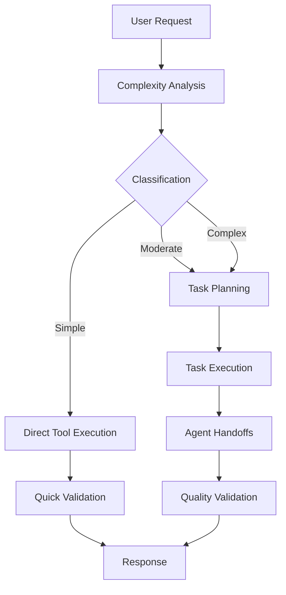

# 🤖 Buddy AI Assistant - Enhanced Orchestration System

> **Production-grade AI assistant with intelligent request routing, agent coordination, and quality assurance**

[](https://www.python.org/downloads/)
[](https://opensource.org/licenses/MIT)


## 📋 Prerequisites

Before running Buddy AI Assistant, ensure you have:

### Required
- **Python 3.12+** - [Download](https://www.python.org/downloads/)
- **UV Package Manager** - [Install](https://docs.astral.sh/uv/getting-started/installation/)
- **Ollama** - [Install](https://ollama.ai/download)

### LLM Setup
```bash
# Install and start Ollama
ollama serve

# Pull required model (in another terminal)
ollama pull llama3.2:3b
```

### System Requirements
- **RAM**: 4GB+ (8GB+ recommended for complex tasks)
- **Storage**: 10GB+ free space
- **OS**: Linux, macOS, or Windows with WSL

## 🚀 Quick Start

```bash
# Install dependencies
uv sync

# Start interactive session
python main.py

# Run single command
python main.py -c "list files in current directory"

# Get help
python main.py --help
```

## 📋 Table of Contents

- [🏗️ Architecture Overview](#️-architecture-overview)
- [🧠 Intelligence System](#-intelligence-system)
- [🔄 Execution Flow](#-execution-flow)
- [🛠️ Tools Reference](#️-tools-reference)
- [🤝 Agent System](#-agent-system)
- [⚙️ Configuration](#️-configuration)
- [📊 Quality Assurance](#-quality-assurance)
- [🔧 Development](#-development)
- [📚 Examples](#-examples)

## 🏗️ Architecture Overview

### System Components

```
┌─────────────────────────────────────────────────────────────┐
│                    BUDDY AI ASSISTANT                       │
├─────────────────────────────────────────────────────────────┤
│  main.py (Entry Point)                                     │
│    ↓                                                       │
│  agentic/client.py (Main Interface)                        │
│    ↓                                                       │
│  agentic/frontend/client.py (Enhanced Client)              │
│    ↓                                                       │
│  agentic/frontend/orchestrator.py (Intelligence Core)      │
│    ↓                                                       │
│  ┌─────────────┐  ┌─────────────┐  ┌─────────────┐        │
│  │   AGENTS    │  │    TOOLS    │  │    CORE     │        │
│  │             │  │             │  │             │        │
│  │ • Planner   │  │ • fs_read   │  │ • Agent     │        │
│  │ • Executor  │  │ • fs_write  │  │ • LLM       │        │
│  │ • Debate    │  │ • bash      │  │ • Config    │        │
│  │             │  │ • introspect│  │             │        │
│  └─────────────┘  └─────────────┘  └─────────────┘        │
└─────────────────────────────────────────────────────────────┘
```

### File Structure

```
agentic/
├── main.py                     # 🚀 Production entry point
├── client.py                   # 🔗 Main interface (updated)
├── frontend/
│   ├── client.py              # 💬 Enhanced client with orchestration
│   └── orchestrator.py        # 🧠 Intelligence and coordination
├── agents/
│   ├── __init__.py            # 📦 Agent exports
│   ├── task_planner.py        # 📋 Task planning agent
│   ├── task_executor.py       # ⚡ Task execution agent
│   └── debate_agent.py        # 💭 Multi-agent debate system
├── tools/
│   ├── fs_read.py             # 📖 File reading operations
│   ├── fs_write.py            # ✏️ File writing operations
│   ├── execute_bash.py        # ⚡ Shell command execution
│   ├── code_interpreter.py    # 🐍 Python code execution
│   ├── introspect.py          # 🔍 Quality validation & retry logic
│   ├── task_monitor.py        # 📊 Progress tracking
│   ├── debate_agent.py        # 💭 Decision analysis
│   ├── task_planner.py        # 📋 Task decomposition
│   ├── task_executor.py       # ⚡ Task execution coordination
│   ├── doc_generator.py       # 📚 Documentation generation
│   ├── code_quality.py        # 🔍 Code analysis
│   └── memory_manager.py      # 💾 Context management
├── core/
│   └── agent.py               # 🏗️ Base agent framework
├── llms/
│   └── client.py              # 🤖 LLM communication
└── configs/
    ├── config.toml            # ⚙️ Main configuration
    ├── loader.py              # 📥 Configuration loader
    └── prompt_manager.py      # 📝 Prompt management
```

## 🧠 Intelligence System

### Complexity Analysis

Buddy automatically analyzes each request and classifies it into three categories:

#### 🟢 **SIMPLE** (≤2 steps)
- **Criteria**: Direct tool usage, minimal coordination
- **Examples**: "List files", "Read config.py", "Run ls command"
- **Execution**: Direct tool execution → Quick validation → Response
- **Tools Used**: `fs_read`, `fs_write`, `execute_bash`, `code_interpreter`

#### 🟡 **MODERATE** (3-5 steps)
- **Criteria**: Requires planning, multiple tool coordination
- **Examples**: "Create documentation", "Analyze code quality", "Setup project"
- **Execution**: Task planning → Sequential execution → Validation

#### 🔴 **COMPLEX** (6+ steps)
- **Criteria**: Comprehensive planning, agent handoffs, decision points
- **Examples**: "Build web application", "Conduct system analysis", "Multi-step workflows"
- **Execution**: Task planning → Parallel execution → Agent handoffs → Quality assurance

### Intelligence Flow



## 🔄 Execution Flow

### 1. **Request Reception**
```python
# User input received
user_request = "Create a web application with database"

# Add to conversation history
conversation_history.append({"role": "user", "content": user_request})
```

### 2. **Complexity Analysis**
```python
# LLM-based analysis
complexity = await orchestrator._analyze_complexity(user_request)
# Result: RequestComplexity.COMPLEX
```

### 3. **Route Selection**

#### Simple Route (≤2 steps)
```python
# Direct tool execution
tool_name = determine_tool(request)  # e.g., "fs_read"
result = execute_tool(tool_name, request)
validation = introspect_tool.validate(result)
return formatted_response(result)
```

#### Complex Route (3+ steps)
```python
# Task planning phase
plan = task_planner.create_plan(request)
# Result: {"tasks": [...], "execution_order": [...]}

# Task execution phase
for task in plan.tasks:
    result = task_executor.execute(task)
    
    # Agent handoffs as needed
    if needs_debate(task):
        debate_result = debate_agent.analyze(task, result)
    
    # Quality validation
    validation = introspect_tool.review(task, result)
    
    if validation.next_action == "retry":
        # Retry with feedback
        result = task_executor.retry(task, validation.feedback)
    elif validation.next_action == "escalate":
        # Human intervention needed
        break

return comprehensive_response(results)
```

### 4. **Quality Assurance**
```python
# Performance scoring (0-10 scale)
score = introspect_tool.calculate_score(
    criteria_met=criteria_evaluation,
    efficiency=execution_efficiency
)

# Retry decision
if score < 7:  # Below threshold
    return "retry"
elif score >= 7:
    return "proceed"
```

### 5. **Response Generation**
```python
# Format user-friendly response
response = format_response(
    complexity=complexity,
    results=execution_results,
    validation=quality_validation,
    attempts=retry_count
)

# Display with rich formatting
console.print(response)
```

## 🛠️ Tools Reference

### 📁 **File Operations**

#### `fs_read` - File Reading Operations
```python
# Read file content
fs_read(operations=[{
    "mode": "Line",
    "path": "/path/to/file.py",
    "start_line": 1,
    "end_line": 50
}])

# List directory
fs_read(operations=[{
    "mode": "Directory", 
    "path": "/path/to/dir",
    "depth": 2
}])

# Search in files
fs_read(operations=[{
    "mode": "Search",
    "path": "/path/to/file.py",
    "pattern": "function_name"
}])
```

**Capabilities:**
- Read file lines (with range support)
- Directory listing (with depth control)
- Pattern searching (case-insensitive)
- Batch operations support
- Image file processing

#### `fs_write` - File Writing Operations
```python
# Create new file
fs_write(
    command="create",
    path="/path/to/new_file.py",
    file_text="print('Hello, World!')"
)

# Modify existing file
fs_write(
    command="str_replace",
    path="/path/to/file.py",
    old_str="old_function()",
    new_str="new_function()"
)

# Insert content
fs_write(
    command="insert",
    path="/path/to/file.py",
    insert_line=10,
    new_str="# New comment"
)
```

**Capabilities:**
- File creation and overwriting
- String replacement (exact match)
- Content insertion at specific lines
- Content appending
- Automatic backup creation

### ⚡ **Execution Tools**

#### `execute_bash` - Shell Command Execution
```python
# Run shell commands
execute_bash(command="ls -la /home/user")
execute_bash(command="pip install requests")
execute_bash(command="git status")
```

**Capabilities:**
- Shell command execution
- Environment variable access
- Output capture (stdout/stderr)
- Exit code handling
- Security sandboxing

#### `code_interpreter` - Python Code Execution
```python
# Execute Python code
code_interpreter(code="""
import pandas as pd
df = pd.read_csv('data.csv')
print(df.head())
""")
```

**Capabilities:**
- Python code execution
- Package import support
- Variable persistence across calls
- Output capture and formatting
- Error handling and traceback

### 🧠 **Intelligence Tools**

#### `introspect` - Quality Validation & Retry Logic
```python
# Task completion review
introspect(
    action="task_review",
    task_review={
        "task_id": "analysis_task",
        "task_description": "Analyze system requirements",
        "solution_provided": "Analysis complete with recommendations",
        "success_criteria": ["Complete analysis", "Recommendations provided"],
        "actual_result": result_data,
        "execution_time": 15.2,
        "retry_count": 0
    }
)
```

**Capabilities:**
- Performance scoring (0-10 scale)
- Success criteria evaluation
- Retry decision logic
- Feedback generation for improvements
- Quality analysis and recommendations

**Actions:**
- `task_review`: Comprehensive task evaluation
- `critique`: Action analysis and feedback
- `validate`: Context validation
- `reflect`: Self-assessment
- `improve`: Improvement suggestions

#### `debate_agent` - Multi-Agent Decision Analysis
```python
# Structured debate analysis
debate_agent(
    decision="Should we adopt microservices architecture?",
    context="Team of 8 developers, 6-month timeline, limited DevOps expertise",
    debate_style="pros_cons"
)
```

**Capabilities:**
- Multi-perspective analysis
- Structured debate format
- Role-based agents (Advocate, Critic, Expert, Moderator)
- Evidence-based arguments
- Final verdict synthesis

**Debate Styles:**
- `pros_cons`: Advantages vs disadvantages
- `alternatives`: Multiple solution comparison
- `devil_advocate`: Challenge assumptions
- `stakeholder_views`: Different stakeholder perspectives

### 📋 **Planning & Execution Tools**

#### `task_planner` - Task Decomposition & Planning
```python
# Create execution plan
task_planner(
    user_request="Create a web application with authentication",
    complexity="complex",
    max_tasks=8
)
```

**Capabilities:**
- Request decomposition into subtasks
- Dependency analysis and ordering
- Tool selection for each task
- Execution timeline estimation
- Resource requirement analysis

**Output Format:**
```json
{
    "total_tasks": 5,
    "complexity_score": 8,
    "execution_order": ["task_1", "task_2", "task_3"],
    "tasks": [
        {
            "id": "task_1",
            "name": "Setup Project Structure",
            "description": "Create directory structure and config files",
            "tool": "fs_write",
            "dependencies": [],
            "success_criteria": "Project structure created"
        }
    ]
}
```

#### `task_executor` - Task Execution Coordination
```python
# Execute task plan
task_executor(
    plan_json=json.dumps(task_plan),
    execute_phase="Phase 1"  # Optional: specific phase
)
```

**Capabilities:**
- Sequential and parallel task execution
- Dependency resolution
- Progress monitoring integration
- Error handling and recovery
- Result aggregation and reporting

#### `task_monitor` - Progress Tracking
```python
# Start monitoring
task_monitor(action="start", task_id="web_app", task_name="Build Web App")

# Update progress
task_monitor(action="update", task_id="web_app", current_status="50% complete")

# Complete task
task_monitor(action="complete", task_id="web_app", evidence=["Tests passed", "Deployed"])
```

**Capabilities:**
- Real-time progress tracking
- Evidence collection
- Status reporting
- Multi-task coordination
- Timeline monitoring

### 📚 **Documentation & Quality Tools**

#### `doc_generator` - Documentation Generation
```python
# Generate documentation
doc_generator(
    content="Function analysis and API documentation",
    doc_type="markdown",
    title="API Reference"
)
```

**Capabilities:**
- Multiple format support (Markdown, HTML, PDF)
- Code documentation extraction
- API reference generation
- README file creation
- Technical specification writing

#### `code_quality` - Code Analysis & Quality Assurance
```python
# Analyze code quality
code_quality(
    code="def example_function():\n    return 'hello'",
    check_type="comprehensive"
)
```

**Capabilities:**
- Syntax validation
- Style checking (PEP 8)
- Security vulnerability scanning
- Performance analysis
- Best practices validation

**Check Types:**
- `syntax`: Basic syntax validation
- `style`: Code style and formatting
- `security`: Security vulnerability scan
- `performance`: Performance analysis
- `comprehensive`: All checks combined

#### `memory_manager` - Context & Memory Management
```python
# Store context
memory_manager(
    action="store",
    key="project_config",
    value={"name": "web_app", "version": "1.0"}
)

# Retrieve context
memory_manager(action="retrieve", key="project_config")
```

**Capabilities:**
- Context storage and retrieval
- Session memory management
- Cross-conversation persistence
- Structured data storage
- Memory optimization

## 🤝 Agent System

### Agent Architecture

```python
# Base Agent Class
class Agent:
    def __init__(self, config: AgentConfig):
        self.config = config
        self.llm_client = LLMClient()
        self.conversation_history = []
        self.tools_registry = {}
```

### Specialized Agents

#### 📋 **TaskPlannerAgent**
```python
# Responsibilities
- Request analysis and decomposition
- Task dependency mapping
- Tool selection and sequencing
- Resource estimation
- Timeline planning

# Usage
planner = TaskPlannerAgent(config)
plan = await planner.create_plan(user_request, complexity)
```

#### ⚡ **TaskExecutorAgent**
```python
# Responsibilities
- Task execution coordination
- Progress monitoring
- Error handling and recovery
- Result aggregation
- Quality validation integration

# Usage
executor = TaskExecutorAgent(config)
result = await executor.execute_tasks(tasks, parallel=False)
```

#### 💭 **DebateAgent**
```python
# Responsibilities
- Multi-perspective analysis
- Structured argumentation
- Evidence evaluation
- Consensus building
- Decision recommendation

# Roles
- ADVOCATE: Argues for the position
- CRITIC: Challenges and questions
- EXPERT: Provides technical insights
- MODERATOR: Facilitates and synthesizes

# Usage
debate = DebateAgent(config, role=DebateRole.ADVOCATE, debate_config)
result = await debate.opening_statement()
```

### Agent Handoff Protocol

```python
# Handoff conditions
def needs_debate(plan):
    """Check if plan requires debate analysis"""
    decision_keywords = ["decision", "choose", "evaluate", "compare"]
    return any(keyword in str(plan).lower() for keyword in decision_keywords)

# Handoff execution
if needs_debate(plan):
    debate_result = await handle_debate_handoff(plan, execution_result)
    execution_result["debate_analysis"] = debate_result
```

## ⚙️ Configuration

### Main Configuration (`agentic/configs/config.toml`)

```toml
[settings]
auto_approve = false
stream = true
debug = false

[model]
name = "llama3.2:3b"
base_url = "http://localhost:11500"
temperature = 0.7
max_tokens = 2048

[tools]
default_tools = [
    "fs_read", "fs_write", "execute_bash", "code_interpreter",
    "introspect", "debate_agent", "task_planner", "task_executor",
    "task_monitor", "doc_generator", "code_quality", "memory_manager"
]

[reasoning]
retry_count = 2
complexity_threshold = 7
performance_threshold = 7

[orchestration]
simple_max_steps = 2
moderate_max_tasks = 5
complex_max_tasks = 10
```

### Environment Variables

```bash
# LLM Configuration
export OLLAMA_HOST="localhost:11500"
export MODEL_NAME="llama3.2:3b"

# Debug Settings
export DEBUG=true
export LOG_LEVEL="INFO"

# Performance Settings
export MAX_RETRIES=2
export TIMEOUT_SECONDS=300
```

## 📊 Quality Assurance

### Performance Scoring System

#### Scoring Algorithm
```python
# Criteria Score (70% weight)
criteria_score = (met_criteria / total_criteria) * 10

# Efficiency Score (30% weight)
efficiency_score = 10.0
efficiency_score -= retry_count * 1.5  # Retry penalty
if execution_time > 60:
    efficiency_score -= min(3.0, execution_time / 60)  # Time penalty

# Final Score
final_score = (criteria_score * 0.7) + (efficiency_score * 0.3)
```

#### Decision Thresholds
- **Score ≥ 7**: Proceed to next task
- **Score < 7**: Retry with feedback
- **3+ Retries**: Escalate to human review

### Retry Mechanism

#### Retry Strategy
```python
for attempt in range(max_retries + 1):
    try:
        result = execute_task(task)
        validation = introspect_tool.review(task, result)
        
        if validation.next_action == "proceed":
            break
        elif validation.next_action == "retry" and attempt < max_retries:
            # Apply feedback and retry
            task = apply_feedback(task, validation.feedback)
            continue
        else:
            # Max retries reached or escalation needed
            handle_failure(task, validation)
            
    except Exception as e:
        if attempt < max_retries:
            await asyncio.sleep(retry_delay * (2 ** attempt))  # Exponential backoff
        else:
            raise e
```

#### Feedback Integration
```python
# Example retry feedback
{
    "feedback_for_retry": "Focus on: Documentation created, All sections included. Current issues: Failed criterion: Documentation created",
    "recommendations": ["Review template structure", "Add missing sections"],
    "next_action": "retry"
}
```

## 🔧 Development

### Setup Development Environment

```bash
# Clone repository
git clone <repository-url>
cd applied-GenAI-lab

# Install dependencies
uv sync

# Install development dependencies
uv add --dev pytest black flake8 mypy

# Setup pre-commit hooks
pre-commit install
```

### Running Tests

```bash
# Run all tests
uv run pytest tests/

# Run specific test categories
uv run pytest tests/test_agents_simple.py
uv run pytest tests/test_introspect_enhanced.py
uv run pytest tests/test_orchestration_simple.py

# Run with coverage
uv run pytest --cov=agentic tests/
```

### Code Quality

```bash
# Format code
uv run black agentic/

# Lint code
uv run flake8 agentic/

# Type checking
uv run mypy agentic/

# Run all quality checks
uv run pytest tests/ && uv run black agentic/ && uv run flake8 agentic/
```

### Adding New Tools

1. **Create tool file** in `agentic/tools/`
```python
from .base import BaseTool, ToolMetadata, ToolCategory

class MyNewTool(BaseTool):
    def __init__(self):
        metadata = ToolMetadata(
            name="my_new_tool",
            description="Description of what the tool does",
            category=ToolCategory.INTELLIGENCE
        )
        super().__init__(metadata)
    
    def get_parameters_schema(self):
        # Return OpenAI-compatible schema
        pass
    
    def execute(self, **kwargs):
        # Tool implementation
        pass
```

2. **Register in tool manager** (`agentic/tools/__init__.py`)
3. **Add to default tools** in config.toml
4. **Write tests** in `tests/`

### Adding New Agents

1. **Create agent file** in `agentic/agents/`
```python
from ..core.agent import Agent, AgentConfig

class MyNewAgent(Agent):
    def __init__(self, config: AgentConfig):
        super().__init__(config)
        # Agent-specific initialization
    
    async def process_request(self, request: str):
        # Agent implementation
        pass
```

2. **Export in** `agentic/agents/__init__.py`
3. **Integrate with orchestrator** if needed
4. **Add tests** and documentation

## 📚 Examples

### Example 1: Simple File Operation
```bash
# Command
python main.py -c "list all Python files in the current directory"

# Execution Flow
1. Complexity Analysis → SIMPLE
2. Tool Selection → fs_read
3. Direct Execution → fs_read(operations=[{"mode": "Directory", "path": "."}])
4. Quick Validation → introspect validates result
5. Response → "Found 15 Python files: main.py, agentic/client.py, ..."
```

### Example 2: Moderate Task
```bash
# Command
python main.py -c "create documentation for the project structure"

# Execution Flow
1. Complexity Analysis → MODERATE
2. Task Planning → task_planner creates 3-step plan
3. Task Execution → 
   - Step 1: Analyze project structure (fs_read)
   - Step 2: Generate documentation (doc_generator)
   - Step 3: Save to README (fs_write)
4. Quality Validation → introspect scores 8/10
5. Response → "Documentation created successfully"
```

### Example 3: Complex Multi-Agent Task
```bash
# Command
python main.py -c "analyze whether we should adopt microservices architecture"

# Execution Flow
1. Complexity Analysis → COMPLEX
2. Task Planning → task_planner creates comprehensive analysis plan
3. Task Execution →
   - Research current architecture (fs_read, code_quality)
   - Analyze requirements (introspect)
   - Conduct structured debate (debate_agent handoff)
     * Advocate: Arguments for microservices
     * Critic: Arguments against microservices  
     * Expert: Technical analysis
     * Moderator: Final recommendation
4. Quality Validation → introspect reviews debate quality
5. Response → "Comprehensive analysis complete with recommendation"
```

### Example 4: Interactive Session
```bash
python main.py

# Interactive conversation
You: Can you help me build a web application?
Buddy: I'll analyze your request and create a comprehensive plan...

# Complexity: COMPLEX
# Plan: 8 tasks including setup, backend, frontend, database, testing
# Execution: Sequential task execution with progress monitoring
# Handoffs: Code quality checks, documentation generation
# Result: Complete web application with all components
```

## 🔒 Security & Best Practices

### Security Features
- **Input Validation**: All user inputs are validated before processing
- **Command Sanitization**: Shell commands are sanitized to prevent injection
- **File Access Control**: File operations are restricted to safe directories
- **Error Handling**: Sensitive information is not exposed in error messages

### Best Practices
- **Retry Logic**: Intelligent retry with exponential backoff
- **Resource Management**: Proper cleanup of resources and connections
- **Logging**: Comprehensive logging for debugging and monitoring
- **Configuration**: Secure configuration management with environment variables

## 🚀 Production Deployment

### Requirements
- Python 3.12+
- UV package manager
- Ollama (for local LLM) or OpenAI API access
- 4GB+ RAM recommended
- 10GB+ disk space

### Deployment Steps
1. **Environment Setup**
```bash
# Production environment
export ENVIRONMENT=production
export LOG_LEVEL=INFO
export DEBUG=false
```

2. **Configuration**
```bash
# Update config.toml for production
[settings]
auto_approve = true  # For automated environments
stream = false       # For API usage
debug = false

[model]
base_url = "https://api.openai.com/v1"  # Or your production LLM endpoint
```

3. **Service Setup**
```bash
# Create systemd service
sudo cp buddy.service /etc/systemd/system/
sudo systemctl enable buddy
sudo systemctl start buddy
```

## 📈 Performance & Monitoring

### Metrics Tracked
- **Request Processing Time**: End-to-end request handling
- **Tool Execution Time**: Individual tool performance
- **Success Rate**: Percentage of successful completions
- **Retry Rate**: Frequency of retry attempts
- **Quality Scores**: Average performance scores

### Monitoring Integration
- **Structured Logging**: JSON-formatted logs for analysis
- **Health Checks**: Built-in health monitoring endpoints
- **Metrics Export**: Prometheus-compatible metrics
- **Error Tracking**: Comprehensive error reporting

## 🤝 Contributing

### Development Workflow
1. Fork the repository
2. Create feature branch (`git checkout -b feature/amazing-feature`)
3. Make changes and add tests
4. Run quality checks (`uv run pytest && uv run black . && uv run flake8`)
5. Commit changes (`git commit -m 'Add amazing feature'`)
6. Push to branch (`git push origin feature/amazing-feature`)
7. Open Pull Request

### Code Standards
- **Python Style**: Black formatting, PEP 8 compliance
- **Type Hints**: Full type annotation required
- **Documentation**: Docstrings for all public functions
- **Testing**: Minimum 80% test coverage
- **Security**: Security review for all changes

## 📄 License

This project is licensed under the MIT License - see the [LICENSE](LICENSE) file for details.

## 🆘 Support

### Getting Help
- **Documentation**: This README and inline code documentation
- **Issues**: GitHub Issues for bug reports and feature requests
- **Discussions**: GitHub Discussions for questions and community support

### Common Issues
- **LLM Connection**: Ensure Ollama is running or API keys are configured
- **Permission Errors**: Check file permissions and directory access
- **Memory Issues**: Increase available RAM or reduce concurrent tasks
- **Timeout Errors**: Adjust timeout settings in configuration

---

**Built with ❤️ by Pranav Jha**

*Empowering developers with intelligent AI assistance and orchestration*
