# 🧑‍💻 Buddy: Autonomous Software Engineering Agent

🚀 **Build software autonomously with AI**—Buddy is an edge-ready agent that handles coding, testing, deployment, and more, powered by efficient, smaller models.  
🔗 **See it in action**: Explore traces from simple to complex tasks on [Weights & Biases](https://wandb.ai/pranav_jha/buddy-agent-project/weave/traces?view=traces_default).

---

## 📖 Overview

**Buddy** is an autonomous AI agent designed to act as your **personal software engineer**, managing the full development lifecycle: **requirement gathering**, **implementation**, **testing**, **deployment**, **monitoring**, and **productization at scale**. 

Inspired by innovations like **Amazon Q** and advancements in AI reasoning [1][2], Buddy enables **local-first, low-latency, and private** AI assistance on consumer-grade CPUs/GPUs, eliminating cloud dependency.

---
🎥 Live Demo: Try Buddy yourself


## 💡 Why Buddy?

Think of Buddy as your **AI-powered intern or junior developer** that:

- Understands plain-language requirements
- Implements and tests features
- Debugs and fixes issues
- Writes, commits, and optionally deploys code
- Collaborates in a multi-agent ecosystem

Just **ask Buddy in the terminal**, and it autonomously handles tasks, from bug fixes to building frameworks, aligning with the rise of **experience-driven agents** with memory, self-reflection, and task planning [2].

---

## 🎯 Project Vision

### Goal
To showcase **powerful agentic AI systems** running efficiently on local machines, enabling **fully autonomous software development workflows** without heavy cloud infrastructure, inspired by scalable autonomy research [1].

### Key Features
- **🤖 Autonomous Task Execution**: Manages planning → coding → testing → deployment.
- **🧠 Intelligent Decision-Making**: Multi-agent reasoning for architectural and technical choices.
- **⚡ Edge-Ready AI**: Lightweight models (e.g., Phi, Gemma, Mistral) for consumer hardware.
- **🔧 Tool-Based Architecture**: Modular tools with intelligent coordination (inspired by Toolformer).
- **📊 Future Roadmap**: Tool-augmented reinforcement learning for continual improvement [1].

### Research Objectives
1. Enhance **multi-agent coordination** architectures.
2. Advance **tool-based learning** with plug-and-play AI tools.
3. Optimize **edge deployment** for real-world software engineering.
4. Develop a **reinforcement learning framework** with dynamic memory and tools.

---

## 🏗️ System Architecture

```
┌─────────────────────────────────────────────────────────────┐
│                    BUDDY AI ASSISTANT                       │
├─────────────────────────────────────────────────────────────┤
│ main.py → agentic/frontend/client.py (BuddyClient)          │
│                                                            │
│ ┌─────────────────┐ ┌─────────────────┐ ┌─────────────────┐ │
│ │ COMPLEXITY      │ │ REQUEST         │ │ TOOL            │ │
│ │ ANALYSIS        │ │ ROUTING         │ │ COORDINATION    │ │
│ │ • Simple        │ │ • Direct Tool   │ │ • 6 Core Tools  │ │
│ │ • Moderate      │ │ • Planning      │ │ • 2 AI Agents   │ │
│ │ • Complex       │ │ • Debate        │ │ • Streaming     │ │
│ └─────────────────┘ └─────────────────┘ └─────────────────┘ │
│                                                            │
│ ┌─────────────────────────────────────────────────────────┐ │
│ │                 AGENT ECOSYSTEM                         │ │
│ │  🎯 DebateAgent   📋 TaskPlanner   🔍 Introspection     │ │
│ │  Multi-perspective Intelligent     Self-reflection     │ │
│ │  analysis         task breakdown   & validation        │ │
│ └─────────────────────────────────────────────────────────┘ │
└─────────────────────────────────────────────────────────────┘
```

---

## ✅ Use Cases

- **"Add a new feature"**: Describe it in plain text, and Buddy plans, implements, and tests it.
- **"Fix a bug"**: Share an error trace or describe the issue, and Buddy patches and validates it.
- **"Build a framework or microservice"**: Specify goals, and Buddy handles the implementation while you focus on high-level design.

---

## 🚀 Getting Started

### Installation
1. **Install Ollama**  
   Follow instructions on the [official Ollama website](https://ollama.com/download) for your OS.

2. **Pull the Reasoning Model**  
   ```bash
   ollama pull <reasoning-model>
   ```

3. **Install uv**  
   Use `uv`, a fast Python package manager:
   ```bash
   pip install uv
   ```

4. **Clone and Set Up the Repository**  
   ```bash
   git clone https://github.com/Jha-Pranav/applied-GenAI-lab.git
   cd applied-GenAI-lab
   uv sync
   ```

5. **Run Buddy**  
   ```bash
   uv run main.py
   ```

### Configuration
Configure Buddy in `agentic/configs/config.toml`:

```toml
[model]
name = "qwen3:14b"
url = "http://localhost:11434/v1"
api_key = "ollama"
```

---

## 📚 Documentation

| Topic | Description |
|-------|-------------|
| [Architecture](docs/ARCHITECTURE.md) | System design, execution flow, and core capabilities |
| [Agents & Tools](docs/AGENTS_AND_TOOLS.md) | Details on BuddyAgent, DebateAgent, TaskPlanner, and tools |
| [Usage Guide](docs/USAGE.md) | Examples, features, and advanced usage patterns |
| [Configuration](docs/CONFIGURATION.md) | Setup options, custom tools, and performance monitoring |
| [Project Structure](docs/PROJECT_STRUCTURE.md) | Directory layout and component organization |

---

## 🤖 Core Components

- **🎯 BuddyAgent**: Central orchestrator with intelligent request routing.
- **🛠️ 6 Core Tools**: File system, execution, and intelligence tools for task execution.
- **🧠 2 Specialized Agents**: 
  - **DebateAgent**: Multi-perspective analysis.
  - **TaskPlanner**: Intelligent task breakdown for complex projects.
- **⚡ Real-time Streaming**: Live responses with visible thinking processes.

---
# 🔄 Buddy AI System - Complete Execution Flow Diagram

## 📊 Master Flow Architecture

```mermaid
graph TD
    A[👤 User Request] --> B[🤖 BuddyClient]
    B --> C[🧠 Complexity Analysis]
    
    C --> D{Complexity Level?}
    
    %% Simple Flow
    D -->|Simple| E[⚡ Direct Tool Execution]
    E --> F[🛠️ Execute Tool]
    F --> G[📊 Return Results]
    
    %% Moderate/Complex Flow
    D -->|Moderate/Complex| H[🔄 Multi-Phase Execution]
    
    H --> I[📋 Phase 1: Planning]
    I --> J{Requires Planning?}
    J -->|Yes| K[🎯 Task Planner Agent]
    J -->|No| L[📋 Phase 2: Debate Analysis]
    
    %% Planning Phase
    K --> K1[📊 Project Breakdown Generation]
    K1 --> K2[🔧 Task Generation Loop]
    K2 --> K3[📝 Task Creation]
    K3 --> K4[✅ Pre-execution Validation]
    K4 --> K5{Validation Passed?}
    K5 -->|No| K6[🔄 Task Regeneration with Feedback]
    K6 --> K4
    K5 -->|Yes| K7[📋 Task Ready for Execution]
    K7 --> K8{More Tasks?}
    K8 -->|Yes| K2
    K8 -->|No| L
    
    %% Debate Phase
    L --> M{Requires Debate?}
    M -->|Yes| N[🎯 Debate Agent]
    M -->|No| O[📋 Phase 3: Execution]
    
    %% Debate Analysis
    N --> N1[🏛️ Multi-Perspective Analysis]
    N1 --> N2[⚖️ Pros & Cons Evaluation]
    N2 --> N3[🎯 Decision Recommendation]
    N3 --> O
    
    %% Execution Phase
    O --> P[🔄 Task Execution Loop]
    P --> Q[📝 Select Next Task]
    Q --> R[✅ Pre-execution Validation]
    R --> S{Validation OK?}
    S -->|No| T[🔄 Regenerate Task]
    T --> R
    S -->|Yes| U[🚀 Execute Task Actions]
    
    %% Action Execution
    U --> V[🔄 Action Loop]
    V --> W[🛠️ Tool Selection & Execution]
    W --> X[📊 Capture Results]
    X --> Y{More Actions?}
    Y -->|Yes| V
    Y -->|No| Z[✅ Post-execution Validation]
    
    %% Post-execution Validation
    Z --> AA[🔍 Introspection Analysis]
    AA --> BB[📊 Success Criteria Check]
    BB --> CC{Success Criteria Met?}
    CC -->|No| DD[⚠️ Task Failed - Log & Continue]
    CC -->|Yes| EE[✅ Task Completed Successfully]
    
    DD --> FF{More Tasks?}
    EE --> FF
    FF -->|Yes| P
    FF -->|No| GG[📊 Final Project Status]
    
    %% Final Status
    GG --> HH{Any Failed Tasks?}
    HH -->|Yes| II[⚠️ PARTIAL_SUCCESS Status]
    HH -->|No| JJ[✅ SUCCESS Status]
    
    II --> KK[📋 Comprehensive Report]
    JJ --> KK
    KK --> LL[💾 Cache Results]
    LL --> MM[📤 Return to User]
    
    %% Error Handling
    F --> NN{Tool Error?}
    NN -->|Yes| OO[🔄 Retry Logic]
    NN -->|No| G
    OO --> PP{Max Retries?}
    PP -->|No| F
    PP -->|Yes| QQ[❌ Tool Failed]
    QQ --> G
    
    %% Streaming & Progress
    W --> RR[📡 Streaming Output]
    RR --> SS[📊 Progress Tracking]
    SS --> X
    
    %% Tool Approval
    W --> TT{Requires Approval?}
    TT -->|Yes| UU[⚠️ User Approval Prompt]
    TT -->|No| RR
    UU --> VV{Approved?}
    VV -->|Yes| RR
    VV -->|No| WW[❌ Tool Execution Cancelled]
    WW --> X

    %% Styling
    classDef userInput fill:#e1f5fe
    classDef analysis fill:#f3e5f5
    classDef planning fill:#e8f5e8
    classDef execution fill:#fff3e0
    classDef validation fill:#fce4ec
    classDef decision fill:#f1f8e9
    classDef error fill:#ffebee
    classDef success fill:#e8f5e8
    
    class A userInput
    class C,D,J,M,S,CC,HH analysis
    class I,K,K1,K2,K3,K7 planning
    class O,P,U,V,W execution
    class K4,R,Z,AA,BB validation
    class K5,K8,Y,FF,NN,PP,TT,VV decision
    class DD,OO,QQ,WW error
    class EE,JJ,KK success
```


## 🔍 Detailed Component Flows

### 1. Complexity Analysis Flow

```mermaid
graph TD
    A[User Request] --> B[LLM Analysis]
    B --> C[Analyze Factors]
    C --> D[• Number of steps required]
    C --> E[• Technical complexity]
    C --> F[• Decision-making needs]
    C --> G[• File operations required]
    C --> H[• Planning requirements]
    C --> I[• Debate analysis needs]
    
    D --> J[Complexity Score]
    E --> J
    F --> J
    G --> J
    H --> J
    I --> J
    
    J --> K{Score Evaluation}
    K -->|0-3| L[Simple: Direct tool execution]
    K -->|4-7| M[Moderate: Planning + execution]
    K -->|8-10| N[Complex: Planning + debate + execution]
    
    L --> O[requires_planning: false]
    L --> P[requires_debate: false]
    
    M --> Q[requires_planning: true]
    M --> R[requires_debate: false]
    
    N --> S[requires_planning: true]
    N --> T[requires_debate: true]
```



### 2. Task Planning & Generation Flow


### 3. Debate Agent Decision Flow

```mermaid
graph TD
    A[Decision Request] --> B[Debate Agent Initialization]
    B --> C[Create Multiple Agents]
    C --> D[🏛️ Advocate Agent]
    C --> E[⚖️ Critic Agent]
    C --> F[🎓 Expert Agent]
    C --> G[👨‍⚖️ Moderator Agent]
    
    D --> H[Opening Statement: Pro Position]
    E --> I[Opening Statement: Con Position]
    F --> J[Opening Statement: Technical Analysis]
    
    H --> K[Round 1: Arguments]
    I --> K
    J --> K
    
    K --> L[Cross-examination Phase]
    L --> M[Counter-arguments]
    M --> N[Evidence Presentation]
    N --> O[Round 2: Rebuttals]
    
    O --> P[Moderator Analysis]
    P --> Q[Synthesize Perspectives]
    Q --> R[Generate Recommendation]
    R --> S[Final Decision Report]
```



### 4. Tool Execution & Validation Flow

```mermaid
graph TD
    A[Tool Execution Request] --> B{Tool Type}
    
    B -->|fs_read| C[File System Read]
    B -->|fs_write| D[File System Write]
    B -->|execute_bash| E[Shell Command]
    B -->|code_interpreter| F[Python Execution]
    B -->|debate_agent| G[Debate Analysis]
    B -->|task_planner| H[Task Planning]
    
    C --> I[Git Integration Check]
    D --> J[Diff Preview Generation]
    E --> K[Security Validation]
    F --> L[Safe Environment Setup]
    G --> M[Multi-agent Initialization]
    H --> N[LLM Analysis Setup]
    
    I --> O[Execute Operation]
    J --> P{User Approval?}
    P -->|Yes| O
    P -->|No| Q[Cancel Operation]
    K --> O
    L --> O
    M --> O
    N --> O
    
    O --> R[Capture Results]
    R --> S[Post-execution Validation]
    S --> T[Success Criteria Check]
    T --> U{Criteria Met?}
    U -->|Yes| V[✅ Success]
    U -->|No| W[❌ Failure]
    
    V --> X[Update Context]
    W --> Y[Log Failure Details]
    X --> Z[Continue Execution]
    Y --> Z
```



### 5. Error Handling & Recovery Flow


## ❤️ Built for Developers

Buddy empowers developers with **intelligent automation** for complex technical tasks, running efficiently on the edge.

*Empowering the future of software engineering with AI-driven assistance.*

---
