# 🧑‍💻 Buddy – Autonomous Software Engineering Agent

> **🚀 Pushing the boundaries of agentic AI on the edge with autonomous software engineering capabilities powered by small, efficient models.**

---

## 📖 Introduction

**Buddy** is an autonomous AI agent designed to replicate the core responsibilities of a software engineer — from **requirement gathering** and **implementation** to **testing**, **deployment**, **monitoring**, and even **productization at scale**.

This project began as a personal exploration into how **agentic AI systems** can autonomously manage software development workflows, inspired by research and innovations like **Amazon Q** and new paradigms in AI reasoning and autonomy [1][2].

Buddy brings the power of these ideas to the **edge** — enabling local-first, low-latency, private, and efficient AI assistants that require **no cloud dependency** and can run on consumer-grade CPUs/GPUs.

---

## 💡 What is Buddy?

Think of Buddy as your personal **AI-powered intern or junior developer** that:

* Understands plain-language requirements
* Implements and tests features
* Fixes bugs
* Writes code, commits it, and optionally deploys it
* Works collaboratively in a multi-agent ecosystem

Whether you're working on a complex framework or need a bug fix, you simply **ask Buddy in the terminal**, and it takes care of the rest — autonomously and efficiently.

This aligns with the emerging shift toward **experience-driven agents** capable of memory, self-reflection, and task planning [2].

---

## 🎯 Project Objectives

### Vision: **Autonomous Software Engineering at Scale**

Demonstrate that **powerful agentic AI systems** can be run efficiently on local machines, enabling **fully autonomous software development workflows** without relying on massive cloud infrastructure — consistent with ideas from recent research into scalable autonomy [1].

---

### Mission Highlights

* **🤖 Autonomous Task Execution**
  End-to-end development lifecycle: planning → coding → testing → deployment

* **🧠 Intelligent Decision-Making**
  Multi-agent reasoning for architectural, technical, and strategic choices

* **⚡ Edge-Ready AI**
  Lightweight models running on consumer-grade hardware (Phi, Gemma, Mistral, etc.)

* **🔧 Tool-Based Architecture**
  Modular tools with intelligent selection and coordination (cf. Toolformer, etc.)

* **📊 Reinforcement Learning (Future Roadmap)**
  Tool-augmented reinforcement learning and continual improvement [1]

---

### Research Goals

1. Advance **multi-agent coordination** architectures
2. Explore **tool-based learning** and plug-and-play AI tools
3. Push the boundaries of **edge deployment** for real-world software engineering
4. Develop a **framework for reinforcement learning with tools** and dynamic memory

---

## 🏗️ System Architecture

```
┌─────────────────────────────────────────────────────────────────┐
│                    BUDDY AI ASSISTANT                          │
├─────────────────────────────────────────────────────────────────┤
│  main.py → agentic/frontend/client.py (BuddyClient)            │
│                                                                 │
│  ┌─────────────────┐  ┌─────────────────┐  ┌─────────────────┐ │
│  │ COMPLEXITY      │  │ REQUEST         │  │ TOOL            │ │
│  │ ANALYSIS        │  │ ROUTING         │  │ COORDINATION    │ │
│  │                 │  │                 │  │                 │ │
│  │ • Simple        │  │ • Direct Tool   │  │ • 6 Core Tools  │ │
│  │ • Moderate      │  │ • Planning      │  │ • 2 AI Agents   │ │
│  │ • Complex       │  │ • Debate        │  │ • Streaming     │ │
│  └─────────────────┘  └─────────────────┘  └─────────────────┘ │
│                                                                 │
│  ┌─────────────────────────────────────────────────────────────┐ │
│  │                    AGENT ECOSYSTEM                         │ │
│  │                                                             │ │
│  │  🎯 DebateAgent     📋 TaskPlanner     🔍 Introspection    │ │
│  │  Multi-perspective  Intelligent        Self-reflection     │ │
│  │  analysis           task breakdown      & validation       │ │
│  └─────────────────────────────────────────────────────────────┘ │
└─────────────────────────────────────────────────────────────────┘
```

---

## ✅ Example Use Cases

* **"Add a new feature."** → Describe it in plain text. Buddy plans, implements, and tests it.
* **"Fix a bug."** → Share an error trace or describe the behavior. Buddy finds, patches, and validates it.
* **"Build a new framework or microservice."** → Describe the architecture or goals, and let Buddy handle the heavy lifting, while you focus on "vibe coding."

---


## 🚀 Quick Start

### Installation

```bash
# Clone repository
git clone <repository-url>
cd applied-GenAI-lab

# Install dependencies
pip install -r requirements.txt

# Run the assistant
python main.py
```

### Configuration

The system uses `agentic/configs/config.toml` for configuration:

```toml
[model]
name = "qwen3:14b"
url = "http://192.168.29.147:11500/v1/chat/completions"
api_key = "ollama"
timeout = 300.0
temperature = 0.7
max_tokens = 10000

[settings]
auto_approve = true
stream = true
debug = false
max_history = 100

[reasoning]
show_thinking = true
max_reasoning_steps = 10
retry_count = 2
```

## 🤖 Current Agents & Tools Inventory

### 🎯 Autonomous Agents (2 Active)

#### 1. **DebateAgent** (`agentic/agent/debater.py`)
- **Purpose**: Multi-perspective analysis and structured decision making
- **Capabilities**: 
  - Creates 4 specialized agents (Advocate, Critic, Expert, Moderator)
  - Conducts structured debates with opening statements and rebuttals
  - Provides balanced recommendations with evidence-based analysis
- **Use Cases**: Architectural decisions, technology choices, policy analysis
- **Model**: Qwen 3:8B with streaming output

#### 2. **TaskPlanner** (`agentic/agent/planner/`)
- **Purpose**: Intelligent task breakdown and execution planning
- **Capabilities**:
  - Project complexity analysis and framework selection
  - Hierarchical task decomposition with dependencies
  - Pre/post-execution validation with feedback loops
  - Caching system for performance optimization
- **Components**: 
  - `main.py` - Orchestration layer
  - `executor.py` - Task execution coordinator
  - `task_generator.py` - LLM-powered task creation
  - `validation.py` - Quality assurance system
- **Model**: Qwen 3:14B with advanced reasoning

### 🛠️ Core Tools (6 Active)

#### File System Tools
1. **`fs_read`** - Advanced file discovery with Git integration and fuzzy matching
2. **`fs_write`** - Intelligent file operations with diff preview and validation

#### Execution Tools  
3. **`execute_bash`** - Secure shell command execution with environment control
4. **`code_interpreter`** - Safe Python code execution with output capture

#### Intelligence Tools
5. **`debate_agent`** - Tool wrapper for DebateAgent with streaming support
6. **`task_planner`** - Tool wrapper for TaskPlanner with caching

### 🔄 Tool Selection & Coordination

#### LLM-Powered Selection
- **Intelligent Routing**: LLM analyzes request context and selects appropriate tools
- **No Hardcoded Rules**: Dynamic tool selection based on request semantics
- **Multi-tool Coordination**: Automatic chaining and dependency management

#### Example Tool Selection Logic
```python
# User: "Should we migrate to microservices? Analyze pros and cons"
# LLM sees: [fs_read, fs_write, execute_bash, code_interpreter, debate_agent, task_planner]
# LLM selects: debate_agent (for decision analysis)

# User: "Create a web API with authentication and database"  
# LLM selects: task_planner (for complex project planning)

# User: "Read the config file and show database settings"
# LLM selects: fs_read (for simple file operations)
```
# 🔄 Buddy AI System - Complete Execution Flow Diagram

## 📊 Master Flow Architecture

```mermaid
graph TD
    A[👤 User Request] --> B[🤖 BuddyClient]
    B --> C[🧠 Complexity Analysis]
    
    C --> D{Complexity Level?}
    
    %% Simple Flow
    D -->|Simple| E[⚡ Direct Tool Execution]
    E --> F[🛠️ Execute Tool]
    F --> G[📊 Return Results]
    
    %% Moderate/Complex Flow
    D -->|Moderate/Complex| H[🔄 Multi-Phase Execution]
    
    H --> I[📋 Phase 1: Planning]
    I --> J{Requires Planning?}
    J -->|Yes| K[🎯 Task Planner Agent]
    J -->|No| L[📋 Phase 2: Debate Analysis]
    
    %% Planning Phase
    K --> K1[📊 Project Breakdown Generation]
    K1 --> K2[🔧 Task Generation Loop]
    K2 --> K3[📝 Task Creation]
    K3 --> K4[✅ Pre-execution Validation]
    K4 --> K5{Validation Passed?}
    K5 -->|No| K6[🔄 Task Regeneration with Feedback]
    K6 --> K4
    K5 -->|Yes| K7[📋 Task Ready for Execution]
    K7 --> K8{More Tasks?}
    K8 -->|Yes| K2
    K8 -->|No| L
    
    %% Debate Phase
    L --> M{Requires Debate?}
    M -->|Yes| N[🎯 Debate Agent]
    M -->|No| O[📋 Phase 3: Execution]
    
    %% Debate Analysis
    N --> N1[🏛️ Multi-Perspective Analysis]
    N1 --> N2[⚖️ Pros & Cons Evaluation]
    N2 --> N3[🎯 Decision Recommendation]
    N3 --> O
    
    %% Execution Phase
    O --> P[🔄 Task Execution Loop]
    P --> Q[📝 Select Next Task]
    Q --> R[✅ Pre-execution Validation]
    R --> S{Validation OK?}
    S -->|No| T[🔄 Regenerate Task]
    T --> R
    S -->|Yes| U[🚀 Execute Task Actions]
    
    %% Action Execution
    U --> V[🔄 Action Loop]
    V --> W[🛠️ Tool Selection & Execution]
    W --> X[📊 Capture Results]
    X --> Y{More Actions?}
    Y -->|Yes| V
    Y -->|No| Z[✅ Post-execution Validation]
    
    %% Post-execution Validation
    Z --> AA[🔍 Introspection Analysis]
    AA --> BB[📊 Success Criteria Check]
    BB --> CC{Success Criteria Met?}
    CC -->|No| DD[⚠️ Task Failed - Log & Continue]
    CC -->|Yes| EE[✅ Task Completed Successfully]
    
    DD --> FF{More Tasks?}
    EE --> FF
    FF -->|Yes| P
    FF -->|No| GG[📊 Final Project Status]
    
    %% Final Status
    GG --> HH{Any Failed Tasks?}
    HH -->|Yes| II[⚠️ PARTIAL_SUCCESS Status]
    HH -->|No| JJ[✅ SUCCESS Status]
    
    II --> KK[📋 Comprehensive Report]
    JJ --> KK
    KK --> LL[💾 Cache Results]
    LL --> MM[📤 Return to User]
    
    %% Error Handling
    F --> NN{Tool Error?}
    NN -->|Yes| OO[🔄 Retry Logic]
    NN -->|No| G
    OO --> PP{Max Retries?}
    PP -->|No| F
    PP -->|Yes| QQ[❌ Tool Failed]
    QQ --> G
    
    %% Streaming & Progress
    W --> RR[📡 Streaming Output]
    RR --> SS[📊 Progress Tracking]
    SS --> X
    
    %% Tool Approval
    W --> TT{Requires Approval?}
    TT -->|Yes| UU[⚠️ User Approval Prompt]
    TT -->|No| RR
    UU --> VV{Approved?}
    VV -->|Yes| RR
    VV -->|No| WW[❌ Tool Execution Cancelled]
    WW --> X

    %% Styling
    classDef userInput fill:#e1f5fe
    classDef analysis fill:#f3e5f5
    classDef planning fill:#e8f5e8
    classDef execution fill:#fff3e0
    classDef validation fill:#fce4ec
    classDef decision fill:#f1f8e9
    classDef error fill:#ffebee
    classDef success fill:#e8f5e8
    
    class A userInput
    class C,D,J,M,S,CC,HH analysis
    class I,K,K1,K2,K3,K7 planning
    class O,P,U,V,W execution
    class K4,R,Z,AA,BB validation
    class K5,K8,Y,FF,NN,PP,TT,VV decision
    class DD,OO,QQ,WW error
    class EE,JJ,KK success
```



## 🔍 Detailed Component Flows

### 1. Complexity Analysis Flow

```mermaid
graph TD
    A[User Request] --> B[LLM Analysis]
    B --> C[Analyze Factors]
    C --> D[• Number of steps required]
    C --> E[• Technical complexity]
    C --> F[• Decision-making needs]
    C --> G[• File operations required]
    C --> H[• Planning requirements]
    C --> I[• Debate analysis needs]
    
    D --> J[Complexity Score]
    E --> J
    F --> J
    G --> J
    H --> J
    I --> J
    
    J --> K{Score Evaluation}
    K -->|0-3| L[Simple: Direct tool execution]
    K -->|4-7| M[Moderate: Planning + execution]
    K -->|8-10| N[Complex: Planning + debate + execution]
    
    L --> O[requires_planning: false]
    L --> P[requires_debate: false]
    
    M --> Q[requires_planning: true]
    M --> R[requires_debate: false]
    
    N --> S[requires_planning: true]
    N --> T[requires_debate: true]
```



### 2. Task Planning & Generation Flow


### 3. Debate Agent Decision Flow

```mermaid
graph TD
    A[Decision Request] --> B[Debate Agent Initialization]
    B --> C[Create Multiple Agents]
    C --> D[🏛️ Advocate Agent]
    C --> E[⚖️ Critic Agent]
    C --> F[🎓 Expert Agent]
    C --> G[👨‍⚖️ Moderator Agent]
    
    D --> H[Opening Statement: Pro Position]
    E --> I[Opening Statement: Con Position]
    F --> J[Opening Statement: Technical Analysis]
    
    H --> K[Round 1: Arguments]
    I --> K
    J --> K
    
    K --> L[Cross-examination Phase]
    L --> M[Counter-arguments]
    M --> N[Evidence Presentation]
    N --> O[Round 2: Rebuttals]
    
    O --> P[Moderator Analysis]
    P --> Q[Synthesize Perspectives]
    Q --> R[Generate Recommendation]
    R --> S[Final Decision Report]
```



### 4. Tool Execution & Validation Flow

```mermaid
graph TD
    A[Tool Execution Request] --> B{Tool Type}
    
    B -->|fs_read| C[File System Read]
    B -->|fs_write| D[File System Write]
    B -->|execute_bash| E[Shell Command]
    B -->|code_interpreter| F[Python Execution]
    B -->|debate_agent| G[Debate Analysis]
    B -->|task_planner| H[Task Planning]
    
    C --> I[Git Integration Check]
    D --> J[Diff Preview Generation]
    E --> K[Security Validation]
    F --> L[Safe Environment Setup]
    G --> M[Multi-agent Initialization]
    H --> N[LLM Analysis Setup]
    
    I --> O[Execute Operation]
    J --> P{User Approval?}
    P -->|Yes| O
    P -->|No| Q[Cancel Operation]
    K --> O
    L --> O
    M --> O
    N --> O
    
    O --> R[Capture Results]
    R --> S[Post-execution Validation]
    S --> T[Success Criteria Check]
    T --> U{Criteria Met?}
    U -->|Yes| V[✅ Success]
    U -->|No| W[❌ Failure]
    
    V --> X[Update Context]
    W --> Y[Log Failure Details]
    X --> Z[Continue Execution]
    Y --> Z
```



### 5. Error Handling & Recovery Flow


## 📊 Key Decision Points

### 1. Complexity Routing
- **Simple (0-3)**: Direct tool execution, no planning
- **Moderate (4-7)**: Planning phase + execution
- **Complex (8-10)**: Planning + debate + execution

### 2. Tool Selection Criteria
- **LLM-driven**: Model analyzes request and selects appropriate tools
- **Context-aware**: Selection based on request content and available tools
- **Multi-tool coordination**: Automatic chaining of related tools

### 3. Validation Gates
- **Pre-execution**: Task consistency and feasibility validation
- **Post-execution**: Success criteria verification and quality assessment
- **Continuous**: Real-time monitoring and progress tracking

### 4. Failure Handling Strategy
- **No task skipping**: Failed regeneration proceeds with original task
- **Execution continuation**: Individual task failures don't stop project
- **Partial success tracking**: New status for mixed results
- **Comprehensive logging**: Detailed failure analysis and reporting

## 🎯 Success Metrics

### Planning Phase
- Task generation success rate
- Validation pass rate
- Framework selection accuracy
- Dependency resolution correctness

### Execution Phase
- Tool execution success rate
- Success criteria achievement
- Error recovery effectiveness
- Overall project completion rate

### Quality Metrics
- Code quality scores
- Best practice adherence
- Security compliance
- Performance optimization

---

**This flow diagram represents the complete execution pipeline of the Buddy AI system, showcasing intelligent routing, comprehensive validation, and robust error handling.**


### 🚀 Future  Framework

#### Tool-Augmented Reinforcement Learning for Knowledge Acquisition
- **Concept**: RL-based agent that learns optimal tool usage patterns
- **Learning Objectives**:
  - Tool selection optimization based on success rates
  - Parameter tuning for improved outcomes
  - Workflow pattern recognition and reuse
  - Continuous improvement through feedback loops

#### Planned  Components
```python
# Future implementation concept
class Agent:
    def __init__(self):
        self.tool_usage_history = []
        self.success_metrics = {}
        self.learned_patterns = {}
    
    def learn_from_execution(self, task, tools_used, outcome):
        """Learn optimal tool usage patterns"""
        
    def optimize_tool_selection(self, request_context):
        """RL-based tool selection optimization"""
        
    def adapt_parameters(self, tool, historical_performance):
        """Dynamic parameter tuning based on success rates"""
```

## 🔄 Complete System Flow

For detailed execution flow including complexity analysis, planning phases, validation gates, and error handling, see: [**System Flow Diagram**](SYSTEM_FLOW_DIAGRAM.md)

### High-Level Flow Summary
1. **Request Analysis** → Complexity scoring (Simple/Moderate/Complex)
2. **Intelligent Routing** → Direct tools vs Planning vs Debate analysis  
3. **Planning Phase** → Task breakdown, validation, regeneration with feedback
4. **Execution Phase** → Tool coordination, streaming output, progress tracking
5. **Validation Gates** → Pre/post-execution validation, success criteria checking
6. **Error Recovery** → No task skipping, partial success tracking, comprehensive logging

## 🧠 Core Capabilities

### 1. Intelligent Request Analysis

The system automatically analyzes request complexity and routes to appropriate execution strategies:

- **Simple**: Direct tool execution
- **Moderate**: Planning with tool coordination  
- **Complex**: Multi-phase execution with debate analysis

### 2. Comprehensive Tool Ecosystem

#### File System Tools
- **`fs_read`**: Advanced file discovery and content extraction with Git integration
- **`fs_write`**: Intelligent file operations with diff preview and validation

#### Execution Tools  
- **`execute_bash`**: Secure shell command execution with environment control
- **`code_interpreter`**: Safe Python code execution with output capture

#### Intelligence Tools
- **`debate_agent`**: Multi-perspective analysis for complex decisions
- **`task_planner`**: Intelligent task breakdown and execution planning

### 3. Multi-Agent Coordination

#### Debate Agent
```python
# Structured debate with multiple perspectives
result = debate_agent(
    topic="Should AI be regulated?",
    context="Government policy discussion",
    perspectives=["security", "innovation", "ethics"]
)
```

#### Task Planner
```python
# Intelligent task planning
plan = task_planner(
    request="Build a web API with authentication and database integration"
)
```

## 📋 Usage Examples

### Simple Request
```bash
# Direct tool usage for simple tasks
"Read the config file and show me the database settings"
```

### Moderate Request  
```bash
# Planning phase with tool coordination
"Create a Python web API with 3 endpoints for user management"
```

### Complex Request
```bash
# Multi-phase execution with debate analysis
"Should we migrate our monolith to microservices? Analyze pros and cons"
```

## 🔧 Advanced Features

### Streaming Output
Real-time response streaming with visual progress indicators:

```
🛠️ Using tool: task_planner (trusted)
⋮
● I will analyze and create a detailed plan for: Build healthcare system

🤔 Thinking...
[Character-by-character streaming output]
```

### Tool Approval Workflow
Configurable approval system for sensitive operations:

```
⚠️  Tool requires approval: execute_bash
Command: rm -rf /tmp/cache
[y/N]: y
```

### Conversation History
Persistent conversation history with context management:

```bash
# View conversation history
/history

# Clear conversation history  
/clear
```

## 🏗️ Project Structure

```
applied-GenAI-lab/
├── main.py                     # Entry point
├── agentic/                    # Core system
│   ├── frontend/
│   │   ├── client.py          # BuddyClient (main orchestrator)
│   │   └── agent_tools.py     # Agent tool wrappers
│   ├── agent/                 # AI Agents
│   │   ├── debater.py         # Multi-perspective debate agent
│   │   └── planner/           # Task planning system
│   │       ├── main.py        # Planner entry point
│   │       ├── executor.py    # Task execution coordinator
│   │       ├── task_generator.py # Task generation engine
│   │       ├── validation.py  # Pre-execution validation
│   │       └── models.py      # Data models
│   ├── tools/                 # Tool ecosystem
│   │   ├── manager.py         # Tool registry and execution
│   │   ├── fs_read.py         # File system reading
│   │   ├── fs_write.py        # File system writing
│   │   ├── execute_bash.py    # Shell command execution
│   │   ├── code_interpreter.py # Python code execution
│   │   ├── debate_agent.py    # Debate tool wrapper
│   │   └── task_planner.py    # Planning tool wrapper
│   ├── configs/               # Configuration management
│   │   ├── config.toml        # Main configuration
│   │   ├── loader.py          # Config loading
│   │   └── prompts.py         # System prompts
│   └── llms/                  # LLM integration
│       └── client.py          # OpenAI-compatible client
├── task_analyzer/             # Standalone task analyzer
│   ├── main.py               # Task analysis entry point
│   └── README_TECHNICAL.md   # Technical documentation
└── benchmark/                # Performance benchmarks
    └── test_prompts.md       # Test scenarios
```

## 🔄 Execution Flow

### 1. Request Processing
```python
# User input → BuddyClient
request = "Create a web API with authentication"

# Complexity analysis
analysis = await client.analyze_request_complexity(request)
# Result: complexity="moderate", requires_planning=true
```

### 2. Intelligent Routing
```python
if analysis.complexity == "simple":
    # Direct tool execution
    result = await client.execute_simple_request(request)
elif analysis.complexity in ["moderate", "complex"]:
    # Multi-phase execution
    result = await client.execute_complex_request(request, analysis)
```

### 3. Tool Coordination
```python
# Tools are automatically selected and coordinated
tools_used = ["fs_write", "execute_bash", "code_interpreter"]

# With streaming output and approval workflow
for tool in tools_used:
    if client.requires_approval(tool):
        approved = await client.get_user_approval(tool, parameters)
    result = client.execute_tool(tool, parameters)
```

## 🎯 Key Features

### ✅ Intelligent Request Analysis
- Automatic complexity detection
- Context-aware routing
- Confidence scoring

### ✅ Multi-Agent Coordination  
- Debate agent for decision analysis
- Task planner for complex projects
- Introspection for quality validation

### ✅ Comprehensive Tool Ecosystem
- File system operations with Git integration
- Secure command execution
- Python code interpretation
- Documentation generation

### ✅ Production-Ready Features
- Streaming output with progress tracking
- Configurable approval workflows
- Error handling and retry logic
- Conversation history management
- Rich console interface

### ✅ Extensible Architecture
- Plugin-based tool system
- Configurable agent behaviors
- Custom prompt management
- Flexible LLM integration

## 🔧 Configuration Options

### Model Configuration
```toml
[model]
name = "qwen3:14b"           # LLM model name
url = "http://..."           # API endpoint
temperature = 0.7            # Response creativity
max_tokens = 10000          # Response length limit
```

### Behavior Settings
```toml
[settings]
auto_approve = true         # Skip approval prompts
stream = true              # Enable streaming output
debug = false              # Debug mode
max_history = 100          # Conversation history limit
```

### Reasoning Configuration
```toml
[reasoning]
show_thinking = true        # Show AI reasoning process
max_reasoning_steps = 10    # Reasoning depth limit
retry_count = 2            # Retry failed operations
```

## 🚀 Advanced Usage

### Custom Tool Development
```python
from agentic.tools.base import BaseTool, ToolMetadata, ToolCategory

class CustomTool(BaseTool):
    def __init__(self):
        super().__init__(ToolMetadata(
            name="custom_tool",
            description="Custom functionality",
            category=ToolCategory.UTILITY
        ))
    
    def execute(self, **kwargs):
        # Custom implementation
        return {"success": True, "result": "Custom result"}
```

### Agent Integration
```python
# Use agents directly
from agentic.agent.debater import create_debate
from agentic.agent.planner.main import main as planner_main

# Structured debate
debate_result = await create_debate(
    topic="Technical decision",
    context="System architecture choice"
)

# Task planning
plan = await planner_main("Build microservices platform")
```

## 📊 Performance & Monitoring

### Built-in Metrics
- Request processing time
- Tool execution duration  
- LLM response latency
- Success/failure rates

### Debugging Support
- Detailed error logging
- Request/response tracing
- Tool execution monitoring
- Agent decision tracking

## 🔮 Future Enhancements

* Persistent memory and context tracking
* Reinforcement learning from human/AI and tool feedback
* GUI frontend for real-time visibility and control
* Evaluation for agent benchmarking

### Extension Points
- Custom tool development
- Agent behavior customization
- LLM provider integration
- Workflow orchestration
- External service integration

---
## 📚 References

1. Chen, Andy, et al. **Tool-Augmented Reinforcement Learning for Language Agents**. arXiv preprint, [arXiv:2506.02153](https://arxiv.org/abs/2506.02153), 2024.

2. DeepMind. **The Era of Experience: A New Foundation for AI**. DeepMind Research, 2024.
   [PDF](https://storage.googleapis.com/deepmind-media/Era-of-Experience%20/The%20Era%20of%20Experience%20Paper.pdf)


**Built with ❤️ for intelligent automation**

*Empowering developers with AI-powered assistance for complex technical tasks*
