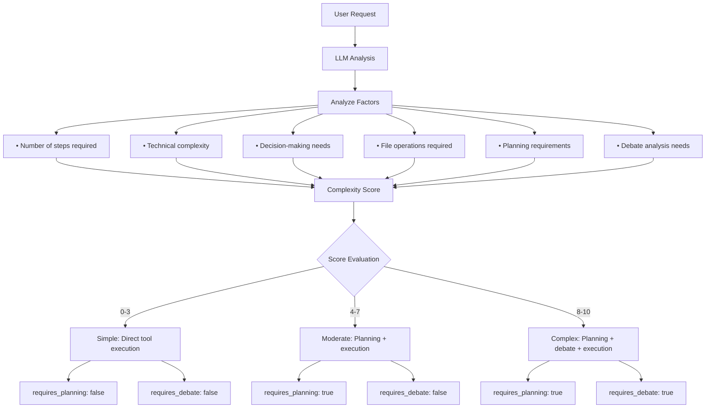
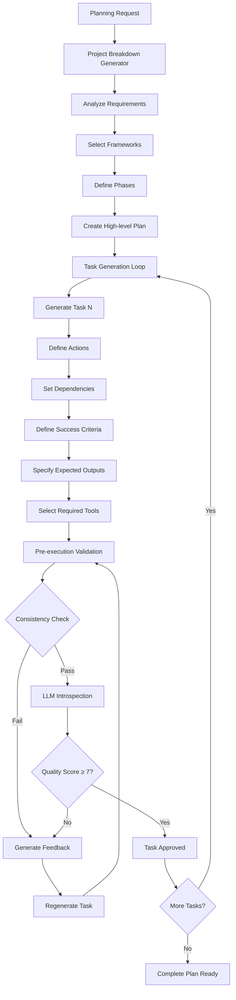
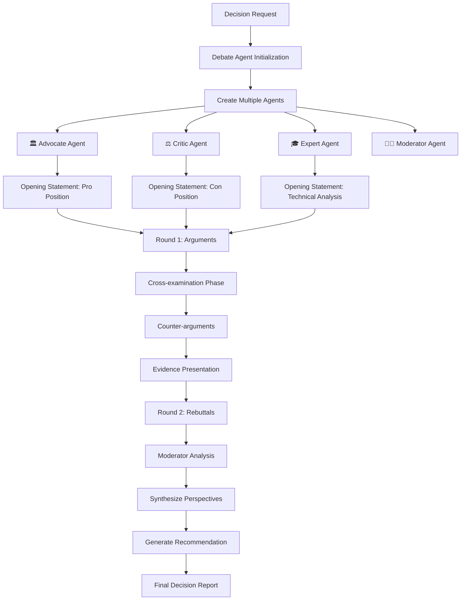
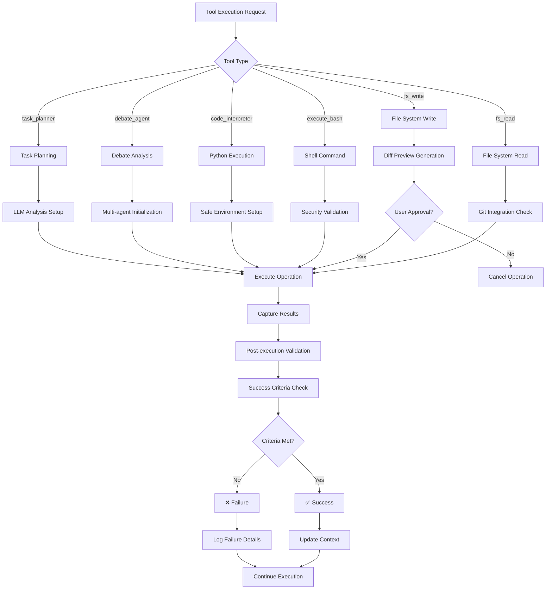
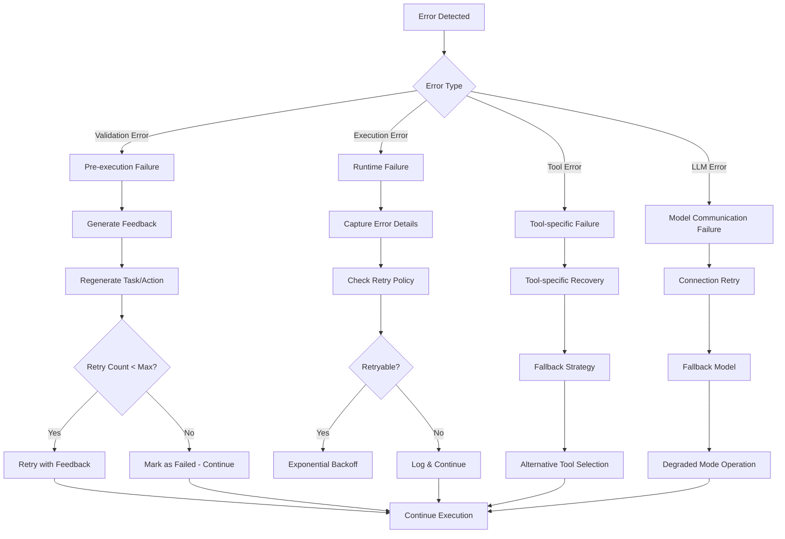

---
# 🔄 Buddy AI System - Complete Execution Flow Diagram

## 📊 Master Flow Architecture

```mermaid
graph TD
    A[👤 User Request] --> B[🤖 BuddyClient]
    B --> C[🧠 Complexity Analysis]
    
    C --> D{Complexity Level?}
    
    %% Simple Flow
    D -->|Simple| E[⚡ Direct Tool Execution]
    E --> F[🛠️ Execute Tool]
    F --> G[📊 Return Results]
    
    %% Moderate/Complex Flow
    D -->|Moderate/Complex| H[🔄 Multi-Phase Execution]
    
    H --> I[📋 Phase 1: Planning]
    I --> J{Requires Planning?}
    J -->|Yes| K[🎯 Task Planner Agent]
    J -->|No| L[📋 Phase 2: Debate Analysis]
    
    %% Planning Phase
    K --> K1[📊 Project Breakdown Generation]
    K1 --> K2[🔧 Task Generation Loop]
    K2 --> K3[📝 Task Creation]
    K3 --> K4[✅ Pre-execution Validation]
    K4 --> K5{Validation Passed?}
    K5 -->|No| K6[🔄 Task Regeneration with Feedback]
    K6 --> K4
    K5 -->|Yes| K7[📋 Task Ready for Execution]
    K7 --> K8{More Tasks?}
    K8 -->|Yes| K2
    K8 -->|No| L
    
    %% Debate Phase
    L --> M{Requires Debate?}
    M -->|Yes| N[🎯 Debate Agent]
    M -->|No| O[📋 Phase 3: Execution]
    
    %% Debate Analysis
    N --> N1[🏛️ Multi-Perspective Analysis]
    N1 --> N2[⚖️ Pros & Cons Evaluation]
    N2 --> N3[🎯 Decision Recommendation]
    N3 --> O
    
    %% Execution Phase
    O --> P[🔄 Task Execution Loop]
    P --> Q[📝 Select Next Task]
    Q --> R[✅ Pre-execution Validation]
    R --> S{Validation OK?}
    S -->|No| T[🔄 Regenerate Task]
    T --> R
    S -->|Yes| U[🚀 Execute Task Actions]
    
    %% Action Execution
    U --> V[🔄 Action Loop]
    V --> W[🛠️ Tool Selection & Execution]
    W --> X[📊 Capture Results]
    X --> Y{More Actions?}
    Y -->|Yes| V
    Y -->|No| Z[✅ Post-execution Validation]
    
    %% Post-execution Validation
    Z --> AA[🔍 Introspection Analysis]
    AA --> BB[📊 Success Criteria Check]
    BB --> CC{Success Criteria Met?}
    CC -->|No| DD[⚠️ Task Failed - Log & Continue]
    CC -->|Yes| EE[✅ Task Completed Successfully]
    
    DD --> FF{More Tasks?}
    EE --> FF
    FF -->|Yes| P
    FF -->|No| GG[📊 Final Project Status]
    
    %% Final Status
    GG --> HH{Any Failed Tasks?}
    HH -->|Yes| II[⚠️ PARTIAL_SUCCESS Status]
    HH -->|No| JJ[✅ SUCCESS Status]
    
    II --> KK[📋 Comprehensive Report]
    JJ --> KK
    KK --> LL[💾 Cache Results]
    LL --> MM[📤 Return to User]
    
    %% Error Handling
    F --> NN{Tool Error?}
    NN -->|Yes| OO[🔄 Retry Logic]
    NN -->|No| G
    OO --> PP{Max Retries?}
    PP -->|No| F
    PP -->|Yes| QQ[❌ Tool Failed]
    QQ --> G
    
    %% Streaming & Progress
    W --> RR[📡 Streaming Output]
    RR --> SS[📊 Progress Tracking]
    SS --> X
    
    %% Tool Approval
    W --> TT{Requires Approval?}
    TT -->|Yes| UU[⚠️ User Approval Prompt]
    TT -->|No| RR
    UU --> VV{Approved?}
    VV -->|Yes| RR
    VV -->|No| WW[❌ Tool Execution Cancelled]
    WW --> X

    %% Styling
    classDef userInput fill:#e1f5fe
    classDef analysis fill:#f3e5f5
    classDef planning fill:#e8f5e8
    classDef execution fill:#fff3e0
    classDef validation fill:#fce4ec
    classDef decision fill:#f1f8e9
    classDef error fill:#ffebee
    classDef success fill:#e8f5e8
    
    class A userInput
    class C,D,J,M,S,CC,HH analysis
    class I,K,K1,K2,K3,K7 planning
    class O,P,U,V,W execution
    class K4,R,Z,AA,BB validation
    class K5,K8,Y,FF,NN,PP,TT,VV decision
    class DD,OO,QQ,WW error
    class EE,JJ,KK success
```

## 🔍 Detailed Component Flows

### 1. Complexity Analysis Flow

### 2. Task Planning & Generation Flow

### 3. Debate Agent Decision Flow

### 4. Tool Execution & Validation Flow

### 5. Error Handling & Recovery Flow

